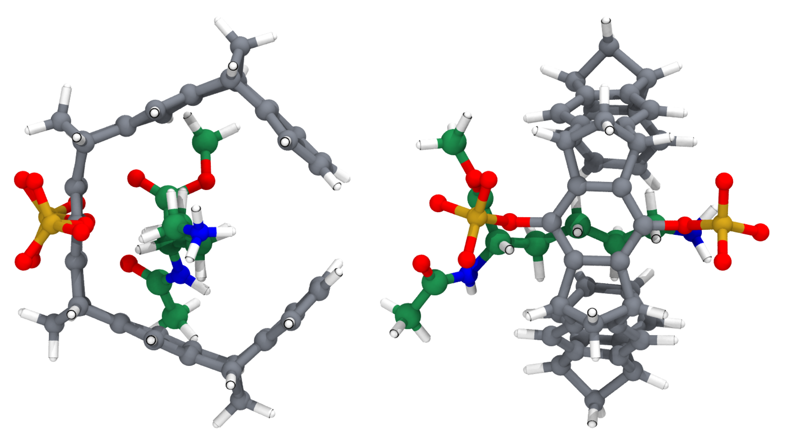
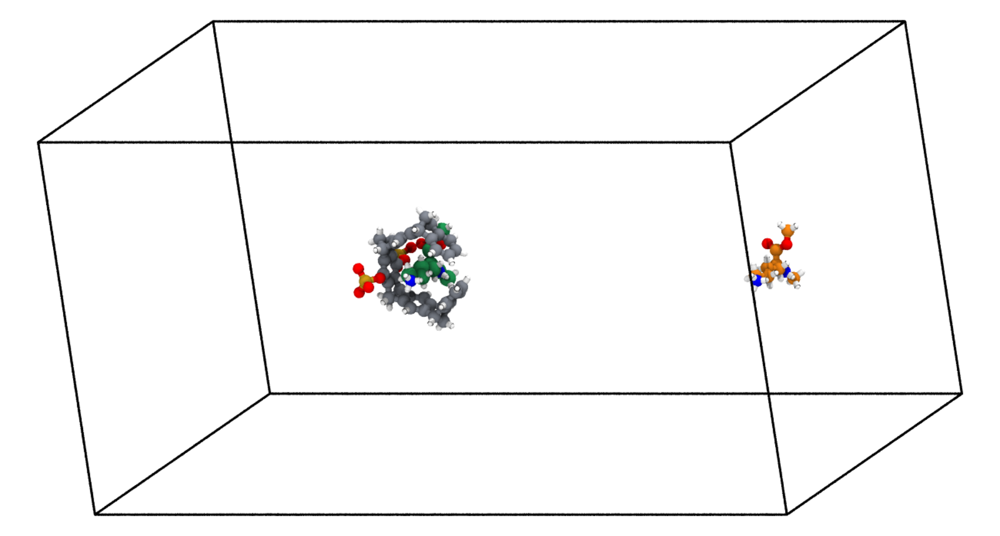
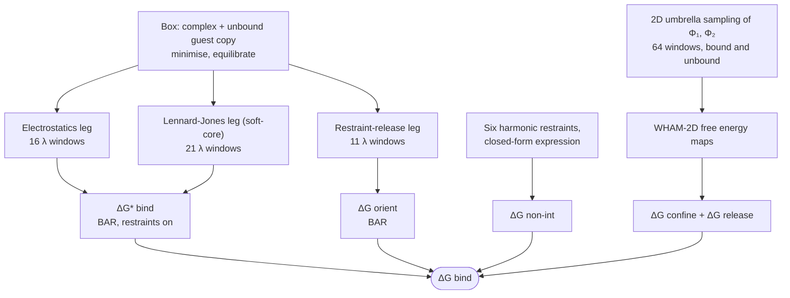
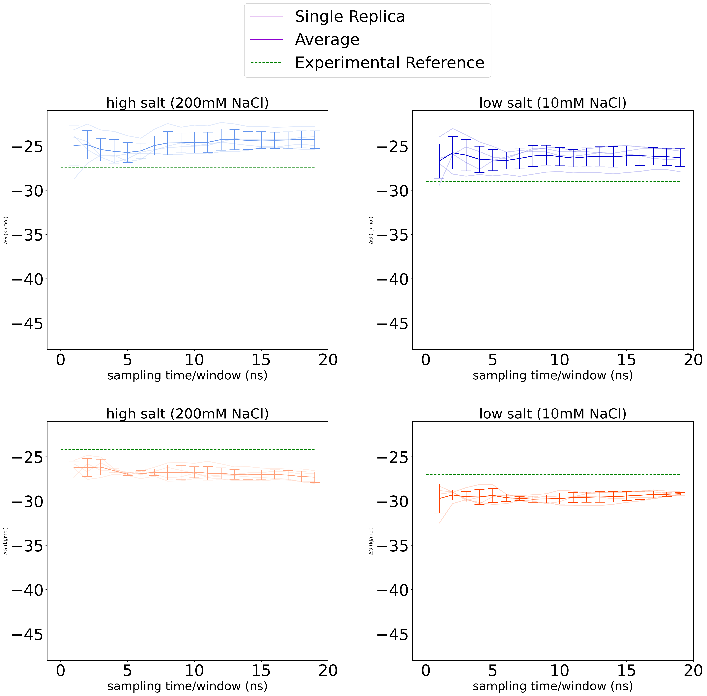

# Host–guest binding free energy: molecular tweezer + capped amino acids

Inputs, scripts and analysis for absolute binding free energy calculations of a
phosphate-substituted molecular tweezer (host) with capped lysine and arginine (guests),
from Chapter 3 of B. Neff, *Unraveling Molecular Behavior: Insights Through Computational
Methods*, PhD thesis, Arizona State University, 2025 (advisor: M. Heyden).

The repository is meant to be a working reference for setting up this kind of calculation in
GROMACS: an alchemical double-decoupling protocol with orientational restraints, plus a 2D
umbrella-sampling correction for slow degrees of freedom in the host.

  

*The tweezer (grey carbons, phosphate groups in gold/red) with Ac-Lys-OMe (green carbons) threaded
through its cavity. Left: looking along the cavity axis. Right: rotated 90°, showing the lysine side
chain passing through the cavity and the two phosphate groups.*

## The problem

The tweezer binds the side chains of lysine and arginine by threading them through its aromatic
cavity, with the phosphate groups contacting the charged end group. Predicting the binding free
energy by simulation turned out to be limited less by the force field than by **two slow degrees of
freedom** that ordinary sampling does not converge:

1. **Reorientation of the bound guest** inside the cavity, which occurs on a nanosecond timescale.
2. **Rotation of the two phosphate groups** (the C–C–O–P dihedrals Φ₁, Φ₂). A phosphate can rotate
   to coordinate the lysine side chain and stay there for most of a 100 ns run; transitions in and
   out of that state are rare.

The protocol in this repository handles each one explicitly: restrain it during the alchemical
calculation, then account for the free energy cost of the restraint.

## Three approaches, in the order they were tried

| | approach | restraints | mean deviation from experiment |
|---|---|---|---|
| 0 | **Physical pathway**: steered MD to pull the guest out, then umbrella sampling along the host–guest distance | position restraints only | > 15 kJ/mol in many cases; salt trend not reproduced |
| 1 | **Alchemical**, centre-of-mass restraints only | none on orientation | 7.25 kJ/mol; not converged at 10 mM |
| 2 | **Alchemical + orientational restraints** (Boresch-type) | guest orientation | 3.19 kJ/mol |
| 3 | **Alchemical + orientational restraints + phosphate dihedral restraints**, with a 2D umbrella-sampling correction | guest orientation and Φ₁, Φ₂ | 2.77 kJ/mol; fastest convergence; salt trend reproduced |

Deviations are averages over the four systems (Lys and Arg guests, 10 mM and 200 mM NaCl) as reported
in the thesis. Approach 3 is what `host-guest_sample_setup/` implements.

## How the alchemical calculation is built

  

*One 80 × 40 × 40 Å box holds the complex (left; bound guest in green) and a second copy of the guest
40 Å away in bulk water (right, orange). In every alchemical window the bound guest's interactions are
scaled down while the unbound copy's are scaled up.*

Switching the two copies in opposite directions means a single simulation returns the
bound-minus-unbound difference, and the net charge of the box is the same at every λ (the guests
carry a +1 charge, and a changing net charge causes finite-size artefacts with Ewald electrostatics).

The binding free energy is assembled from separately computed pieces (thesis eq. 3.8):

$$\Delta G_\mathrm{bind} = \Delta G_\mathrm{confine} + \Delta G_\mathrm{orient} + \Delta G^{*}_\mathrm{bind} + \Delta G_\mathrm{non\text{-}int} + \Delta G_\mathrm{release}$$

| term | what it is | how it is obtained | where |
|---|---|---|---|
| ΔG\*bind | switching the guest off in the site and on in bulk, all restraints applied | electrostatics leg + Lennard-Jones leg, BAR | `host-guest_sample_setup/` |
| ΔGorient | orientational restraints on the fully interacting bound guest | restraint-release leg, BAR | `host-guest_sample_setup/` |
| ΔGnon-int | the same restraints on a non-interacting guest, to the 1 M standard state | closed-form expression (Boresch et al.) | thesis eq. 3.1 |
| ΔGconfine + ΔGrelease | restraining the phosphate dihedrals in one end state and releasing them in the other | 2D umbrella sampling + WHAM, then a ratio of partition functions | `host-guest_sample_setup/sample_2D_us/` |

## Results

  

*Predicted ΔGbind against sampling time per window with both sets of restraints (approach 3).
Top row: lysine; bottom row: arginine. Left: 200 mM NaCl; right: 10 mM. Faint lines are the four
replicas, the solid line their mean, the dashed line the experimental reference.*

The 2D free energy maps that feed the dihedral correction are shown in
[`host-guest_sample_setup/sample_2D_us/`](host-guest_sample_setup/sample_2D_us/).

## Repository map

| path | contents |
|---|---|
| [`host-guest_sample_setup/`](host-guest_sample_setup/) | complete input set for the alchemical calculation (Lys guest; Arg topologies included), with a step-by-step README |
| [`host-guest_sample_setup/sample_2D_us/`](host-guest_sample_setup/sample_2D_us/) | 2D umbrella sampling of the phosphate dihedrals and how the correction term is computed |
| [`figures/`](figures/) | notebooks and data behind the thesis figures: free energy vs. time, 2D maps, 100 ns unbiased runs, cost benchmarking |
| [`docs/`](docs/) | images used in these READMEs and the scripts that regenerate them |

## Simulation settings at a glance

GROMACS 2022.5 · GAFF parameters from AcPype for host and guest · TIP3P water · amber14sb ions ·
PME, 10 Å cutoffs · LINCS on all bonds, 2 fs · NPT at 300 K and 1 bar (Nosé–Hoover,
Parrinello–Rahman) · BAR between neighbouring λ windows · four independent replicas per system.

## Status of the inputs

The input files were consolidated after the project ended, and parts were recovered from other
sources. What that means in practice:

- The topologies, templates and scripts in `host-guest_sample_setup/` are complete and internally
  consistent, but have **not been re-run** since consolidation.
- `amber14sb-modified.ff/` was rebuilt from a preprocessed topology that survived
  (`sample_2D_us/host.top`).
- `index.ndx` for the alchemical legs (restraint anchor groups) is not included and has to be built.
- The soft-core parameters in the Lennard-Jones template are the commonly used GROMACS values, by the
  author's recollection; the original production `.mdp` files were not archived.

Each README lists the specifics for its directory.

## References

- B. Neff, PhD thesis, Arizona State University, 2025, Chapter 3.
- Boresch, Tettinger, Leitgeb, Karplus, *J. Phys. Chem. B* **107**, 9535 (2003): orientational
  restraints and their analytic free energy.
- Mobley, Chodera, Dill, *J. Chem. Theory Comput.* **3**, 1231 (2007): confine-and-release.
- Bennett, *J. Comput. Phys.* **22**, 245 (1976): BAR.
- Grossfield, *WHAM: the weighted histogram analysis method*, http://membrane.urmc.rochester.edu/wordpress/?page_id=126
