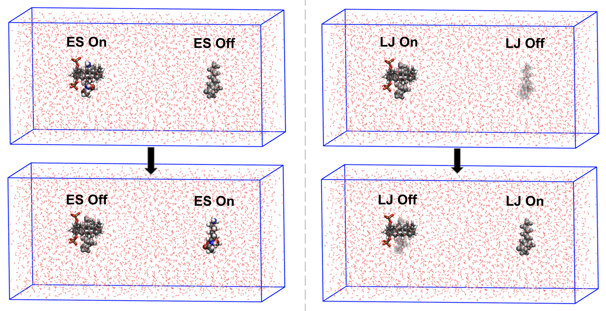

# Alchemical binding free energy: sample setup

A complete input set for the absolute binding free energy of a phosphate-substituted molecular
tweezer (host, residue `DRG`) and capped lysine (guest, Ac-Lys-OMe, residue `LIG`), following
Chapter 3 of B. Neff, PhD thesis (Arizona State University, 2025). The top-level files are the
**lysine** system; the arginine guest topologies are in `arginine_guest/`.

For the overall picture (what is being computed and why the restraints are there) start with the
[top-level README](../README.md). This file is the how-to.

<p align="center">
  
</p>

*The electrostatics (left) and Lennard-Jones (right) legs: the bound guest is switched off while a
second copy in bulk water is switched on (thesis Fig. 3.5).*

## 1. What gets computed here

Three sets of λ windows ("legs"), each a separate directory of independent simulations:

| leg | what changes with λ (0 → 1) | topology | template | windows |
|---|---|---|---|---|
| `charge/` | bound guest charges on → off; unbound guest charges off → on. Lennard-Jones stays on for both. | `fade_charge.top` | `charge-XXX.mdp` | 16 |
| `lj/` | bound guest Lennard-Jones on → off; unbound guest off → on. All guest charges are zero. Soft-core. | `fade_lj.top` | `lj-XXX.mdp` | 21 |
| `final/` | the six orientational restraints on the fully interacting bound guest are scaled to zero | `fade_final.top` | `final-XXX.mdp` | 11 |

The first two legs sum to ΔG\*<sub>bind</sub> and the third gives ΔG<sub>orient</sub> in

$$\Delta G_\mathrm{bind} = \Delta G_\mathrm{confine} + \Delta G_\mathrm{orient} + \Delta G^{*}_\mathrm{bind} + \Delta G_\mathrm{non\text{-}int} + \Delta G_\mathrm{release}$$

ΔG<sub>non-int</sub> is analytic (section 6) and ΔG<sub>confine</sub> + ΔG<sub>release</sub> comes from
[`sample_2D_us/`](sample_2D_us/).

**Why charges before Lennard-Jones.** An atom that still carries charge but has lost its repulsive
core lets an opposite charge fall onto it and the energy diverges. Removing charges first, in their
own leg, avoids that state.

**Why two guest copies.** The bound copy is switched off while the unbound copy, held 40 Å away, is
switched on. One simulation gives the bound-minus-unbound difference and the box net charge never
changes.

## 2. Files

| file | role |
|---|---|
| `complex-trans.pdb` | host + bound guest + unbound guest copy (atoms 1–80, 81–113, 114–146) |
| `host-phos.itp`, `guest.itp` | AcPype/GAFF topologies of the host and of Ac-Lys-OMe |
| `make_fade_itps.py` | builds the six A/B-state guest topologies below from `guest.itp` |
| `charge1-0.itp`, `charge0-1.itp` | bound guest (`guest1`) charges on→off; unbound guest (`guest2`) charges off→on |
| `lj0-1.itp`, `lj1-0.itp` | bound guest LJ on→off; unbound guest LJ off→on (charges zero) |
| `final1-0.itp`, `final0-1.itp` | guest topologies for the restraint-release leg (no B state) |
| `fade_charge.top`, `fade_lj.top`, `fade_final.top` | master topology for each leg |
| `amber14sb-modified.ff/` | force field directory: amber14sb atom types plus the GAFF types and dummy types `M*` |
| `em.mdp`, `equi.mdp` | minimisation and equilibration |
| `charge-XXX.mdp`, `lj-XXX.mdp`, `final-XXX.mdp` | one-window production templates |
| `make_windows.sh`, `run_window.sh` | generate and run the per-window inputs |
| `bar.sh` | BAR over all windows of a leg |
| `arginine_guest/` | the same seven guest topologies for Ac-Arg-OMe |
| `sample_2D_us/` | 2D umbrella sampling of the two phosphate dihedrals |

### How the A and B states are written

GROMACS takes the λ = 0 state from the usual `[ atoms ]` columns and the λ = 1 state from the extra
`typeB chargeB massB` columns:

```
;  nr type resi res atom cgnr   charge     mass    typeB chargeB   massB
    1  C3    1  LIG  CAY    1  -0.172100  12.010    C3   0.00000  12.010     ; charge1-0.itp
    1  C3    1  LIG  CAY    1   0.000000  12.010    MC3  0.00000  12.010     ; lj0-1.itp
```

`MC3`, `MHC`, … are dummy copies of the GAFF types with σ = ε = 0. To build the six files for a new
guest, run `python3 make_fade_itps.py guest.itp`. The script reproduces the original arginine files
and the lysine charge files exactly.

## 3. Workflow

```bash
gmx=gmx    # or gmx_plumed

# 1. box, water, ions, minimisation
$gmx editconf -f complex-trans.pdb -box 8 4 4 -o box.gro
$gmx solvate  -cs -cp box.gro -p fade_charge.top -o solv.gro
$gmx grompp   -f em.mdp -c solv.gro -p fade_charge.top -o tmp.tpr
$gmx genion   -s tmp.tpr -p fade_charge.top -neutral -conc 0.01 -o ions.gro     # 0.2 for 200 mM
$gmx grompp   -f em.mdp -c ions.gro -p fade_charge.top -o em.tpr
$gmx mdrun    -deffnm em

# 2. copy the final [ molecules ] block of fade_charge.top into fade_lj.top and fade_final.top
#    (solvate and genion only update the topology they were given)

# 3. build index.ndx (section 5), then equilibrate
$gmx grompp -f equi.mdp -c em.gro -r ions.gro -p fade_charge.top -n index.ndx -o equi.tpr
$gmx mdrun  -deffnm equi

# 4. each leg
bash make_windows.sh charge      # 16 windows
bash make_windows.sh lj          # 21 windows
bash make_windows.sh final       # 11 windows
(cd charge && for f in run-*.sh; do sbatch $f; done)     # likewise lj/, final/

# 5. analysis: discard the first 1 ns of every window
bash bar.sh charge 1000 10000
bash bar.sh lj     1000 10000
bash bar.sh final  1000 10000
```

For replicas, repeat steps 3–5 in separate directories. The thesis used four, each with its own
equilibration, and reports the mean and spread.

`make_windows.sh` reads the number of windows from the `fep-lambdas` line of the template, so the
template is the only place the λ schedule is defined. `bar.sh` runs `gmx bar` over the per-window
`.xvg` files and prints the leg total.

## 4. Simulation settings

| stage | settings |
|---|---|
| all | PME, 1.0 nm cutoffs, 0.12 nm grid, 4th-order interpolation; LINCS on all bonds; dispersion correction |
| minimisation | steepest descent, 1000 steps |
| equilibration | 100 ps NPT, 1 fs step, 300 K, 1 bar; Berendsen thermostat and barostat (1 ps); velocities generated |
| production | 10 ns per window, 2 fs step; Nosé–Hoover (1 ps), Parrinello–Rahman (2 ps); separate thermostat groups for complex, unbound guest and solvent |
| λ windows | evenly spaced: 16 (charge), 21 (Lennard-Jones), 11 (restraint release) |
| soft-core (LJ leg) | `sc-alpha 0.5`, `sc-power 1`, `sc-sigma 0.3`, `sc-coul no` |

The window counts are the ones the thesis settled on after comparing 11, 16, 21 and 81 windows per
leg with 40 ns windows. Berendsen coupling is used only to relax the system; it does not generate a
correct ensemble, so production switches to Nosé–Hoover and Parrinello–Rahman.

## 5. Restraints

All restraints are set through the pull code in the `.mdp` templates and refer to groups in
`index.ndx`.

| restraint | groups | force constant | purpose |
|---|---|---|---|
| guest positions | `Bind-Protein`, `Lone-Protein` to fixed points (2,2,2) and (6,2,2) nm | 1000 kJ mol⁻¹ nm⁻² | keep the complex and the unbound copy 40 Å apart |
| phosphate dihedrals Φ₁, Φ₂ | `com1`–`com4`, `com5`–`com8` | 100 kJ mol⁻¹ rad⁻², centred at 90° | hold both phosphates pointing away from the cavity |
| orientational, distance | `Lanc1`–`Panc1` | 2000 kJ mol⁻¹ nm⁻² | fix the bound guest's position and orientation relative to the host |
| orientational, 2 angles | `Lanc2 Panc1 Panc2`, `Lanc1 Lanc2 Panc1` | 200 kJ mol⁻¹ rad⁻² | 〃 |
| orientational, 3 dihedrals | `Lanc1 Lanc2 Lanc3 Panc1`, `Lanc2 Lanc3 Panc1 Panc2`, `Lanc3 Panc1 Panc2 Panc3` | 200 kJ mol⁻¹ rad⁻² | 〃 |

Centre-of-mass motion removal is off in production (`comm-mode = None`) because the position
restraints refer to absolute points in the box. The orientational restraints take their reference
values from the starting structure (`pull_coordN_start = yes`).

**Why the orientational restraints.** A guest whose interactions are switched off feels nothing and
would wander through the box; the bound guest also reorients in the cavity on a nanosecond
timescale. Six restraints between three host atoms and three guest atoms remove both problems, and
their cost is computable (section 6).

**`index.ndx` is not included** and has to be built by hand (`gmx make_ndx`). It needs:

- `Complex`, `Lone-Protein`, `Water_and_ions`: temperature-coupling groups (host + bound guest;
  unbound guest; solvent).
- `Bind-Protein`, `Lone-Protein`: the two guest copies.
- `com1`–`com8`: single atoms defining Φ₁ (host atoms 3, 1, 71, 72: C2–C–O–P) and Φ₂ (atoms 5, 2,
  76, 77: C4–C1–O1–P1). These are in `sample_2D_us/index.ndx`.
- `Lanc1`–`Lanc3` (guest) and `Panc1`–`Panc3` (host): single-atom anchors. Per the thesis (§3.2.3):
  on the guest, the acetyl methyl carbon, the ester methyl carbon and Cγ; on the tweezer, the two
  carbons adjacent to the C–C–O–P groups and a third carbon five positions away on one arm.

Check the atom order of every angle and dihedral against the template before running.

## 6. Putting the number together

1. ΔG\*<sub>bind</sub> = (charge leg total) + (Lennard-Jones leg total) from `bar.sh`.
2. ΔG<sub>orient</sub> from the `final` leg.
3. ΔG<sub>non-int</sub>, the free energy of releasing the six restraints on a non-interacting guest
   into the standard volume V° = 1660 ų (thesis eq. 3.1):

$$\Delta G_\mathrm{non\text{-}int} = -k_BT \ln\left[\frac{8\pi^2 V^\circ \sqrt{K_r K_{\theta_A} K_{\theta_B} K_{\phi_A} K_{\phi_B} K_{\phi_C}}}{r_0^2 \sin\theta_{A,0}\,\sin\theta_{B,0}\,(2\pi k_BT)^3}\right]$$

   with the force constants above and r₀, θ<sub>A,0</sub>, θ<sub>B,0</sub> the reference distance and
   angles of your starting structure. For these systems it is about −29 to −30.5 kJ/mol.
4. ΔG<sub>confine</sub> + ΔG<sub>release</sub> from the 2D umbrella sampling.

The signs with which the leg totals enter depend on the direction each leg was run; the bookkeeping
used for the thesis figures is in [`../figures/FEP_plots/FEP_plots.ipynb`](../figures/FEP_plots/).

## 7. Adapting this to another system

- New guest: generate a GAFF topology (AcPype), run `make_fade_itps.py`, replace the guest copies in
  the PDB, and re-choose the three guest anchor atoms.
- New host: re-choose the three host anchors on a rigid part of the molecule, and look for slow
  internal degrees of freedom in a long unbiased run before trusting the result.
- A mutation inside a protein (relative free energy) needs none of the restraint machinery; only
  the A/B topology, the λ windows, soft-core and BAR carry over.

## 8. Provenance and caveats

- **Not re-run since consolidation.** The files are complete and consistent with each other, but
  `grompp`/`mdrun` have not been run on this exact set. `run_window.sh` passes `-maxwarn 2` as the
  original jobs did; read the warnings.
- **Force field directory.** `amber14sb-modified.ff/` was rebuilt: `ffnonbonded.itp` is the modified
  nonbonded file recovered from the original project, and `forcefield.itp`, `ffbonded.itp`,
  `tip3p.itp` and `ions.itp` were extracted from the preprocessed topology `sample_2D_us/host.top`.
  `tip3p.itp` therefore has only the rigid (SETTLE) water model, so `-DFLEXIBLE` in `em.mdp` has no
  effect on water. The `[ atomtypes ]` lines at the top of the `.top` files are commented out
  because the same types are defined in `ffnonbonded.itp`.
- **Soft-core values.** The thesis states soft-core potentials were used in the Lennard-Jones leg.
  The values in `lj-XXX.mdp` are the commonly used GROMACS ones, by the author's recollection; the
  original production `.mdp` files were not archived.
- **Lysine topologies.** `lj0-1.itp`, `lj1-0.itp`, `final1-0.itp` and `final0-1.itp` were regenerated
  with `make_fade_itps.py`; an earlier version of this directory had the arginine files in their place.
- **Window length** is 10 ns in the templates; the λ-resolution benchmarking used 40 ns.
