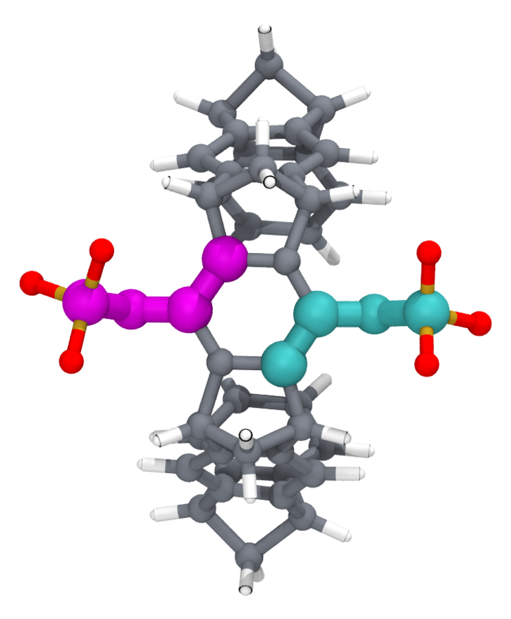
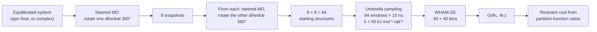
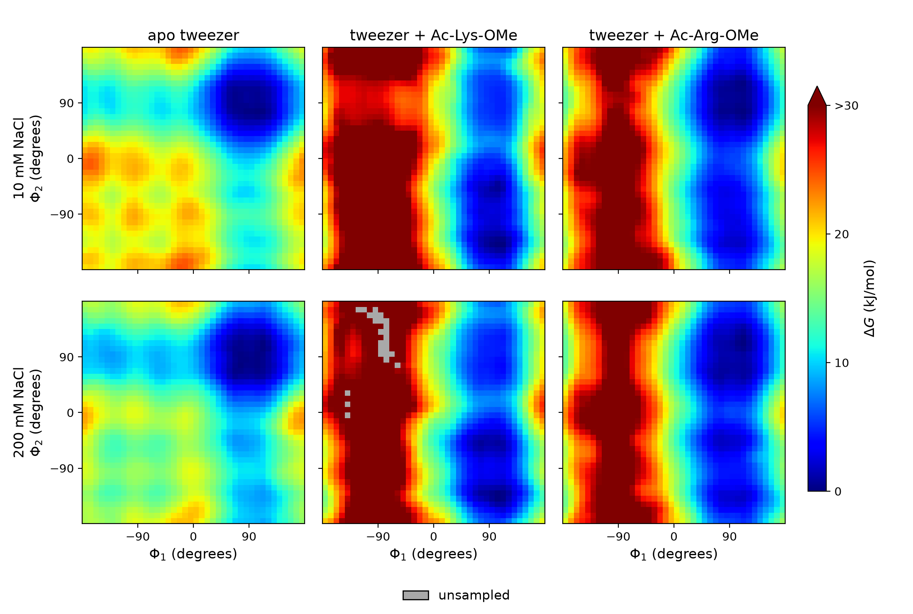

# 2D umbrella sampling of the phosphate dihedrals

This directory computes the free energy surface of the tweezer's two C–C–O–P dihedrals, Φ₁ and Φ₂,
and from it the cost of holding them fixed during the alchemical calculation: the
ΔG<sub>confine</sub> + ΔG<sub>release</sub> term of the binding free energy (thesis §3.2.5–3.2.6).

<p align="center">
  
</p>

*The apo tweezer with the four atoms of Φ₁ (magenta: C2–C–O–P) and Φ₂ (cyan: C4–C1–O1–P1)
highlighted. Each dihedral sets where one phosphate group points.*

## Why this is needed

In a 100 ns unbiased run of the lysine complex, one phosphate rotates to coordinate the lysine side
chain and stays there; transitions in and out are rare. A 10 ns alchemical window cannot sample that
equilibrium, so the answer depends on which state each window happens to start in. The remedy is a
two-dimensional version of the confine-and-release method (Mobley et al.):

1. **Confine.** Restrain both dihedrals to one orientation (90°, pointing away from the cavity,
   k = 100 kJ mol⁻¹ rad⁻²) in every alchemical window, so all windows sample the same host state.
2. **Correct.** Compute what that restraint costs in the bound state and in the unbound state from
   the unrestrained free energy surface G(Φ₁, Φ₂) of each, which is what this directory produces.



## The free energy surfaces

<p align="center">
  
</p>

*G(Φ₁, Φ₂) for the apo tweezer and the lysine and arginine complexes at 10 mM and 200 mM NaCl
(WHAM-2D, 64 windows × 10 ns each). Binding a guest restricts the phosphates sharply: large regions
that the apo host visits freely lie more than 30 kJ/mol above the minimum in the complexes. Data:
`figures/data/2D_umbrella_results/`; regenerate with `docs/render/plot_2d_free_energy_maps.py`.*

## From the surface to the correction

For a harmonic bias U<sub>bias</sub>(Φ₁, Φ₂) on both dihedrals, the free energy of confining a system
with surface G is a ratio of partition functions (thesis eqs. 3.6–3.7):

$$\Delta G_\mathrm{confine} = -k_BT \ln \frac{Z^{*}}{Z}, \qquad
\frac{Z^{*}}{Z} = \frac{\displaystyle\iint e^{-U_\mathrm{bias}(\phi_1,\phi_2)/k_BT}\, e^{-G(\phi_1,\phi_2)/k_BT}\, d\phi_1\, d\phi_2}{\displaystyle\iint e^{-G(\phi_1,\phi_2)/k_BT}\, d\phi_1\, d\phi_2}$$

Evaluate it on the 40 × 40 grid once with the bound-state surface and once with the unbound (apo)
surface. The restraint is imposed in one end state and released in the other, so the two enter with
opposite signs and combine into the single correction term of thesis eq. 3.9:

$$-k_BT \ln\left(\frac{Z_U}{Z_U^{*}} \Big/ \frac{Z_B}{Z_B^{*}}\right)$$

The sums are done in [`figures/2D_umbrella_plots/2D_umbrella_plots.ipynb`](../../figures/2D_umbrella_plots/).
For these systems the correction is a few kJ/mol (about 4 for lysine, about 1 for arginine), and it
converges to within 1 kJ/mol with 10 ns per window.

## Files

| file | role |
|---|---|
| `workflow_2D_us.sh` | the full command sequence, step by step |
| `ions.gro` | solvated, neutralised starting structure of the lysine complex (host 80 atoms, Ac-Lys-OMe 33 atoms, 2120 waters, 3 Na⁺) |
| `complex.top` | topology of the complex; includes `host-phos.itp` and `guest.itp` from the parent directory |
| `host.top` | self-contained (preprocessed) topology of the **apo** host in water, for the unbound-state surface |
| `index.ndx` | groups `com1`–`com8` (the dihedral atoms), `O1`, `NZ`, `Complex`, `Water_and_ions` |
| `mdp_files/em.mdp`, `equi.mdp` | minimisation; 100 ps Berendsen NPT |
| `mdp_files/pre-dihe-NPT.mdp` | 30 ps steered MD moving Φ₁ to the start of the scan |
| `mdp_files/dihe-NPT.mdp` | 200 ps steered MD, Φ₂ rotated at 1.8°/ps, Φ₁ held (k = 5000) |
| `mdp_files/rot_other-NPT.mdp` | 200 ps steered MD, Φ₁ rotated at 1.8°/ps, Φ₂ held (k = 10000) |
| `mdp_files/us_equi.mdp` | optional 20 ps window equilibration |
| `mdp_files/us-NPT+ori.mdp` | umbrella window: 10 ns, k = 50 kJ mol⁻¹ rad⁻² on each dihedral |
| `runXXX.sh`, `equiXXX.sh`, `continuesXXX.sh` | Slurm templates: run, equilibrate, and continue one window |
| `complex.pdb`, `mdp_files/mdout.mdp` | leftovers, see caveats |

## Running it

```bash
# shared inputs live one directory up
ln -s ../amber14sb-modified.ff . && ln -s ../host-phos.itp . && ln -s ../guest.itp .
bash workflow_2D_us.sh        # or run its blocks as separate jobs
```

Details worth knowing:

- **Steering.** During both steered stages a distance restraint between the phosphate oxygen `O1`
  and the lysine `NZ` (0.28 nm, k = 1000) keeps the guest in the site while the phosphates are
  dragged around. It is not present in the umbrella windows.
- **Window centres.** Each window is restrained at the dihedral values of its own starting
  structure (`pull_coord*_start = yes`), so the centres are whatever the steered run produced, not an
  exact 45° grid. Take them from the first line of each `pullx.xvg` when writing the WHAM metadata.
- **Orientation of the complex.** The windows define `-DPOSRES_HOST_ORI -DPOSRES_GUEST_ORI`: weak
  position restraints in x and y on four host carbons and two guest atoms, which keep the complex
  oriented in the box without touching the dihedrals.
- **Guest leaving the site.** No orientational restraints act on the guest in these windows, and in
  a few of them it leaves the cavity. Those frames were removed before WHAM.
- **Apo surface.** Repeat the same procedure with `host.top` and an apo host structure to get the
  unbound-state surface.

### WHAM

The thesis used Alan Grossfield's `wham-2d` with 40 bins per axis and a tolerance of 0.001. Both
coordinates are periodic over 360°. A call has the form

```bash
wham-2d Px=360 -180 180 40  Py=360 -180 180 40  0.001 300 0 metadata.dat outfile.out 0
```

with one line per window in `metadata.dat`: `path  Φ1_centre  Φ2_centre  k1  k2`. Check the units
before running: `wham-2d` assumes kcal/mol and the units of your time series unless it was compiled
otherwise, while GROMACS reports k in kJ mol⁻¹ rad⁻². The output files used for the figures
(`figures/data/2D_umbrella_results/*/*/outfile.out`) have Φ in radians and free energy in kJ/mol.

## Caveats

- Not re-run since the files were consolidated. `runXXX.sh` and `equiXXX.sh` now point at the
  `.mdp` files in `mdp_files/`; the original listing referred to names that did not exist.
- `complex.pdb` contains an **uncapped** lysine (25 atoms), while `complex.top` and `ions.gro`
  describe the capped Ac-Lys-OMe guest (33 atoms). Start from `ions.gro`, not from the PDB.
- `equiXXX.sh` expects input files named `us_equi_XXX.gro`; the workflow produces `us_XXX.gro`.
  Rename or skip the optional equilibration.
- `mdp_files/mdout.mdp` is a `grompp` output from the original project, kept for reference.
- The Slurm templates load `gromacs/2018.1`; the thesis reports GROMACS 2022.5 for production.
